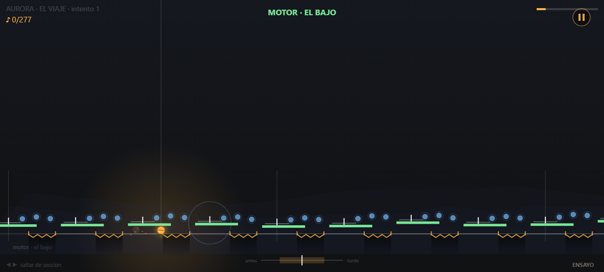

# drible

**El mapa ES la partitura.** Un juego de ritmo de un botón, sin dependencias:
dos archivos, un canvas y sonido sintetizado en el momento.

▶ **Jugar: https://mensetian.github.io/Drible/**



## La idea

La esfera no rebota sola nunca. Cada nota de la melodía es una **tecla física**
flotando a la altura de su tono; pisarla y tocar hace sonar la nota **y** te lanza
exactamente hasta la siguiente. Vos elegís **cuándo**, nunca **cuánto**: el impulso
lo calcula la geometría.

| lo que ves | lo que es |
|---|---|
| altura de la tecla | el tono de la nota |
| distancia entre teclas | la figura rítmica — corchea = salto corto y frenético, semicorchea = escalón pegado, blanca = riel |
| ancho de la tecla | la ventana de tiempo: juzga la geometría, no un reloj |

Tres verbos, y nada más:

- **TOCAR** sobre una tecla → suena la nota y saltás a la próxima.
- **MANTENER** sobre un riel → nota larga. Si soltás, te caés.
- **NO TOCAR** bajo un techo → el silencio del compás.

Fallar una nota te tira a la **red**. No morís: la melodía queda con un hueco (se
oye), y desde la red un toque te reengancha con la próxima tecla. El error cuesta
esa nota, nunca el tramo entero. Sobre los abismos no hay red — ahí el riel se
paga con la vida.

## Vos sos el solista

El fondo es un arreglo de verdad —batería, bajo, arpegio, pad— y la esfera es el
que toca encima. Todo lo que suena por tu mano **ya estaba en la canción**: nada
se agrega, se reparte.

- **Los orbes** flotan sobre el arco del salto y guardan un golpe real del
  arreglo. El fondo lo calla: suena si lo atravesás, o no suena.
- **Los pistones** son caños cuya cabeza se para justo donde pasa el arco de un
  salto tocado a tiempo, y reclaman un golpe del contratiempo (ahí es donde la
  esfera vuela: en los tiempos hay teclas). El arreglo abre un **cráter** en esa
  semicorchea —se hunde a la mitad, pase lo que pase— y caerle encima lo llena
  con tu golpe: el hi-hat se abre, y vuelve con eco. Si pasás de largo, el
  cráter suena vacío: la banda se agachó para un golpe que no llegó.
- **El eco de NEBULOSA.** Es la única sección que no empuja, y la única donde la
  esfera cambia de instrumento: toca **cristal** (senoidales con un parcial
  inarmónico a 3.01x, ataque soplado, un batido lento en vez de vibrato) y cada
  nota **vuelve**, atada al tempo, cada vez más apagada. Lo que llena el aire no
  lo agrega el arreglo: son tus propias notas. Y se ve — dos fantasmas de la
  esfera recorren, atrás, el camino que hiciste una y dos negras con puntillo
  antes.
- **Sobre un riel no hay orbes.** El riel es la única nota que se *sostiene*, y
  un orbe encima pedía picar: dos órdenes opuestas al mismo dedo, en el mismo
  instante. La cosecha vive donde el dedo está libre — el arpegio y el vuelo
  largo entre plataformas.

## Cómo se juega

| | |
|---|---|
| tocar | cualquier tecla, o tocar la pantalla |
| pausa | `Esc`, o el botón de la esquina |
| saltar de sección | `←` `→` (marca la corrida como ENSAYO: no puntúa) |
| tras morir | el informe espera: tocar reintenta · `→` ensaya el tramo · `Esc` al menú |
| en la meta | tocar reintenta · `Esc` vuelve al menú |
| elegir nivel | `1` `2`, o tocar su tarjeta en el mapa |
| volver una pantalla | `Esc` |
| calibrar el desfase | `C` — si tu pantalla o tus auriculares llegan tarde |
| **modo fácil** (con red) | `F`, o en configuración |

Dos canciones, cada una con su mapa: **ESFERA** (100 BPM), que enseña el gesto, y
**AURORA · EL VIAJE**, la canción entera del estudio — 64 compases que van por
actos, con una mecánica y una progresión propias por sección.

**Caer es el final** en todo el recorrido. Eso es el juego, no un extra: una
canción no se pausa. (La red sigue existiendo en el código, para los tramos que
una partitura futura mande rodar; hoy ninguna canción tiene uno — el único que
quedaba, el respiro de NEBULOSA, dejó de ser un silencio.) La red existe igual, en
configuración, como **modo fácil** — es una muleta para aprender la canción, y
dentro del juego ninguno de los dos modos se anuncia: un cartel que te recuerda
en cuál estás es un cartel que te saca de la canción.

La entrada tiene lo tuyo: el color de la esfera, la forma de su estela y la
**marca** que lleva adentro (costura, cruz, gajos o núcleo) — que es lo único que
deja ver que gira, así que es la parte que más se mira mientras se juega.

Y sin red **el piso no se dibuja donde no existe**: la línea de la red aparece
solo en los tramos que la partitura manda rodar, y el resto es oscuridad que se
hunde. Dibujar una red que no aguanta sería mentir.

## Qué se persigue

El único desbloqueo es saber que lo hiciste. El récord de cada canción recuerda
hasta dónde llegaste, cuántas limpias, cuántas **clavadas** (el tercio interior
de la ventana), tu mejor racha y los orbes; y el menú te dice cuánto falta para
el rango siguiente:

`LLEGASTE → AFINADO → MUSICO → VIRTUOSO → AURORA → SUPERNOVA`

AURORA pide la canción entera limpia y todos los orbes. SUPERNOVA, además, el
85% clavado.

## Bajo el capó

- Un solo módulo ES (`juego.js`) y un `index.html`. Sin build, sin dependencias,
  sin assets: las canciones son datos en el código y el audio es WebAudio
  sintetizado nota por nota.
- El nivel **se compila desde la canción**: de la melodía salen las alturas de las
  teclas, de las figuras las distancias, de los silencios los techos. No hay un
  mapa dibujado a mano en ninguna parte.
- El mismo módulo corre en node sin navegador (solo la simulación), que es lo que
  hace testeable un juego de destreza.

## Correrlo local

Los módulos ES no cargan desde `file://`, hace falta un servidor:

```
servidor.bat            # o:  python -m http.server 8000
```

y abrir http://localhost:8000

## Las pruebas

```
npm test                # prueba.js && humo.js
```

- **`prueba.js`** — simula manos reales (perfecta, humana, atrasada) tocando el
  nivel entero, y exige que sea jugable: que ningún salto sea inalcanzable, que
  todo abismo caiga bajo un riel, que ningún pistón esté bajo un techo, que
  tropezar cueste una nota y no el tramo, y que SIN RED lo pueda ganar una mano
  perfecta —si no, el modo castigaría geometría en vez de errores—. Corre la
  suite completa una vez por canción.
- **`humo.js`** — corre la capa de navegador (render + audio) contra un DOM y un
  AudioContext simulados. No juzga cómo se ve: juzga que no explote.

## Origen

Salió de [pipegame](https://github.com/mensetian/pipegame), el taller de
prototipos de juegos de ritmo de un botón. Se mudó acá con su historia completa
cuando dejó de ser un prototipo.
